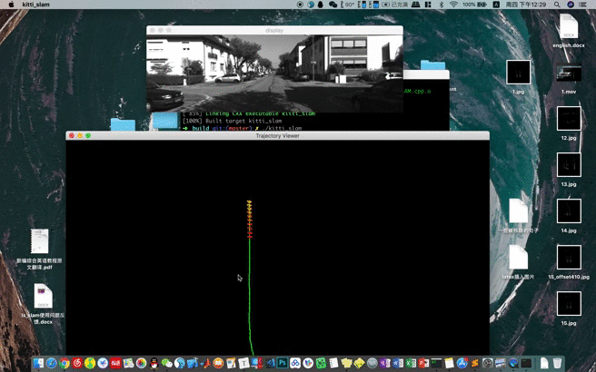

# Map-based-Visual-Localization

  

A general framework for map-based visual localization. It contains

1) Map Generation which support traditional features or deeplearning features.

2) Hierarchical-Localizationvisual in visual(points or line) map.

3) Fusion framework with IMU, wheel odom and GPS sensors.

I will release some related papers and An introduction of the work in the map based visual localization. I guess the introduction will writen in Chinese first. So coming soon, Let's do it.

# **随缘持续更新中!!**

  

 

- 2020.09.04 添加文章结构

[TOC]

## 基于地图的视觉定位
基于已知地图的视觉定位是一个比较大的问题，基本上会涉及到slam系统，重定位，图像检索，特征点提取及匹配，多传感器融合领域。
### 0.写在前面
作者：钟心亮 <https://github.com/TurtleZhong>

在写本文之前，我想先简单的总结一下历年用的比较多的slam系统，另外会提出一些开放性的思考问题，这些思考性的问题我也会提供一个简单粗暴的替代办法或者思路，然后后面讲这个项目可以解决的一些问题以及后面还要探究的问题，原则上来讲，本文：

a）应该不会放出太多的代码[当然看心情]，但会整理一些这个项目参考过的有意思的项目以及一些教学性代码小样；

b）不会涉及到太多公式细节，尽量写成白话文，且大多数东西都能在github上找到或者进行魔改；

c）会有这个项目的一些框架图，以及效果图，应该会对想涉足这个领域的有帮助；

d）会涉及到slam系统，重定位，图像检索，特征点提取及匹配，多传感器融合领域。

主要做了以下方面的一些工作，但也并不是说拿来就能用。

a）基本上支持绝大部分SLAM系统的输出轨迹进行视觉地图构建，当然这是离线的，一方面，有些slam系统的历史轨迹是会经过优化的，所以这部分是拿最终的轨迹和图像来进行离线选择pose和image进行SFM构建地图的；

b）支持传统特征如SIFT以及深度学习特征如SuperPoint等众多特征的地图构建，但问题在于轨迹的来源是各式各样的，我甚至可以使用rtk或者激光雷达作为真值，但实际重定位使用的时候必须要使用与构建视觉地图的特征一致，不然是会定位失败的；

c）整个框架在线定位基本基于C++开发，可以方便集成到ROS，所以也许会提供一个提取深度学习特征点和描述子网络，模型本身不会修改，只是改成cpp版本，便于后续开发，不然ros的python2环境和现在各大网络的python3环境很烦；

d）将SFM重建之后的元素分解整合成视觉定位所依赖的元素，譬如关键帧，特征点，描述子，3D点等等；

e）一个可以兼容传统特征和深度学习特征的重定位框架，之所以叫重定位，是因为基于b步骤的地图定位的，另外本质上确实也是重定位过程；

f）一个理论上可以融合imu， wheel encoder等其它传感器的融合思路或者说方案。之所以要是因为当你机器人走到了没有视觉地图的地方怎么办呢，对吧。

g）代码不一定开源，但会提供思路，会提供相关论文，这些应该只要追了近几年的论文很容易想到，也有很多论文是这么干的，我只是做了一点微小的工作。

### 1.历年slam系统总结与思考
玩视觉slam的小伙伴想必都跑过各种vo，vio，slam系统，至少下面的一款你肯定玩过的ORB-SLAM，SVO，DSO，VINS-Mono，MSCKF，Kimera等等。下面先简单总结一下历年来slam系统的对比，对比如下表

| 时间      | 方案名称    | 传感器             | 前端方法 | 后端方法   | 地图形式  | 融合方式 | 地图保存与复用     | 回环 | 是否开源 | 尺度           | 相对精度误差         | 绝对精度误差/m     | 备注                       |
| --------- | ----------- | ------------------ | :------: | ---------- | --------- | -------- | ------------------ | ---- | -------- | -------------- | -------------------- | ------------------ | -------------------------- |
| 2003      | MonoSLAM    | 单目               |  特征点  | EKF        | 稀疏      | 无       | 否                 | 无   | 是       | 无             | —                    | —                  | VO                         |
| 2007/2017 | PTAM/S-PTAM | 单目/双目          |  特征点  | 非线性优化 | 稀疏      | 无       | 否                 | 无   | 是       | 无             | 1.19%（SPTAM）       | —                  | VO                         |
| 2014      | SVO         | 单目               |  半直接  | 非线性优化 | 稀疏      | 无       | 否                 | 无   | 是       | 无             | 1.7%（EUROC）        |                    | VO                         |
| 2014      | LSD SLAM    | 单目               |  半直接  | 非线性优化 | 半稠密    | 无       | 无                 | 有   | 是       | 无             | 1.2%（KITTI）        |                    | VO                         |
| 2014      | RTAB MAP    | 双目/RGB-D         |  特征点  | 非线性优化 | 稠密      | 无       | 是                 | 有   | 是       | 是             | 1.26%（KITTI）       |                    | VO(研究者相对少，相对商业) |
| 2015      | ORB SLAM2   | 单目/双目/RGB-D    |  特征点  | 非线性优化 | 稀疏      | 无       | 否                 | 有   | 是       | 是(双目/RGB-D) | 1.15%（KITTI）       |                    | VO                         |
| 2015      | ROVIO       | 单目+IMU           |  特征点  | EKF        | 稀疏      | 紧耦合   | 否                 | 无   | 是       | 是             |                      | 0.15-0.6           | VIO                        |
| 2015      | OKVIS       | 双目+IMU           |  特征点  | 非线性优化 | 稀疏      | 紧耦合   | 否                 | 无   | 是       | 是             |                      | 0.08-0.45          | VIO                        |
| 2016      | DSO         | 单目               |  直接法  | 非线性优化 | 半稠密    | 无       | 否                 | 有   | 是       | 否             | 0.93%（S-DSO未开源） |                    | VO                         |
| 2016      | S-MSCKF     | 双目+IMU           |  特征点  | 非线性优化 | EKF       | 紧耦合   | 否                 | 无   | 是       | 是             | 暂无                 | 0.1-0.45           | VIO                        |
| 2017      | VINS-Mono   | 单目+IMU           |  特征点  | 非线性优化 | 稀疏      | 紧耦合   | 是（无3D点云地图） | 有   | 是       | 是             |                      | 0.05-0.24          | VIO 需要运动初始化         |
| 2018      | ICE-BA      | 单目+IMU           |  特征点  | 非线性优化 | 稀疏      | 紧耦合   | 否                 | 无   | 是       | 是             |                      | 0.09-0.25          | 增量式后端优化             |
| 2018      | VINS-Fusion | 双目/双目+IMU\|GPS |  特征点  | 非线性优化 | 稀疏      | 紧耦合   | 是（无3D点云地图） | 有   | 是       | 是             | 1.09%（KITTI）       | 0.12-0.63（KITTI） | 重定位需要初始化           |
| 2018      | R-VIO       | 单目+IMU           |  特征点  | EKF        | 稀疏      | 紧耦合   | 否                 | 无   | 是       | 是             | 暂无                 | 0.1-1.0            |                            |
| 2019      | VINS-RGBD   | RGBD+IMU           |  特征点  | 非线性优化 | 稠密      | 紧耦合   | 是（无3D点云地图） | 有   | 是       | 是             | 暂无                 | 暂无               | 非官方凯源，使用人数相对少 |
| 2019      | Kimera      | 双目+IMU           |  特征点  | 非线性优化 | mesh+语义 | 紧耦合   | 否                 | 有   | 是       | 是             | 暂无                 | 0.05-0.24          | 引入了语义地图             |
| 2019      | Larvio      | 单目+IMU           |  特征点  | EKF        | 稀疏      | 紧耦合   | 否                 | 否   | 是       | 是             | 暂无                 | 0.06-0.25          | VIO                        |

#### 1.1 现有slam系统到实际使用存在的问题
ok 如果这些还不够，那么可以参考吴同学的 [83 项开源视觉 SLAM 方案够你用了吗？](https://zhuanlan.zhihu.com/p/121453686)，参考了那么多的slam系统之后，咱们来思考一下以下问题：

1）是否可以将表格中的一个或者某几个算法原理弄懂，在自己的相机，自己的项目场景中跑起来，修改一些参数适配自己的场景等等。

点我一下看看

想必这个应该是最基础的，玩过的同学至少先能在数据集上跑通，跑通之后大多也都会买一个双目imu相机或者rgbd相机等等，用kalibr标定自己的相机，然后修改配置文件，不出意外的话，你拿着相机不断的动，相机的轨迹就会显示在屏幕上。ok，到这应该大家都是这么过来的。

  

2）有没有小改或者大改过一个开源项目，使得能更鲁棒，cover更多的corner case？ 譬如老板给你提出的下面这些需求：

* a）这个特征提取还是太慢了，我们把他挪到ARM下也得实时，你考虑加速一下？

* b）场景运动太快了，特征跟踪不稳，系统老是崩掉，你能不能改稳定点？

* c）为什么你这个图跟实际场景对不上，一条走廊为什么你来回轨迹都对不上，为什么人家激光雷达就可以？

* d）能不能把imu和轮子还要多个相机给我加进去，到底能不能行？

* e）你这玩意为什么每次坐标系都不一样，好像只在局部有用啊，能不能改一个存地图复用的版本，不然机器人每次导航点都不一样啊？

* f）你这个怎么室内场景稍微变换了一下就不行了，到室外天气变化大点你这不完犊子？

点我一下看看

可能上面的问题有点夸大，但是应该来讲是现实场景中会实实在在遇到的问题。总结来讲，这几个问题可以归结为，大多数slam系统不考虑地图的保存以及复用，试想现在的自动驾驶行业，应该很少有说离开了高精地图来做定位的吧，这里的高精度地图当然也包含激光雷达事先建立好的点云地图。反观到视觉其实也是一样的，如果要完成一个需要满足机器人任何时刻放置在场景中都输出同一个绝对坐标的任务时，譬如室内或者小区送货等等，如果说你事先都没有一张地图的话，那么上面提到的83项slam应该都是以每次启动的时候作为坐标系原点，那么问题来了，你能保证每次都在同一个位置？就算保证了，有一些slam系统还涉及到和imu的初始化，你能保证每次初始化都一样？
所以以上这些东西在实际应用中就会遇到各种奇奇怪怪的问题，而且视觉一般来讲会比激光问题更多一些。

#### 1.2 基于已知地图的视觉定位涉及到的知识

综上，我们这里主要关注的问题在于怎么尽量让一个slam系统可以实际使用，以及结合DL的一些知识去提高系统的鲁棒性。参考2D激光SLAM，使用激光雷达的SMLAM方案，我们先建图，然后保存地图，然后实际使用的时候我们把地图加载进来，然后对单帧图像进行重定位，再然后融合其他信息譬如轮子和IMU和GPS来做融合定位，这样机器人的定位输出坐标系就是你事先建立的那张地图的坐标系了，所有东西都基于一个坐标系是十分nice的！那么到这里基于已知地图的视觉定位主要会包含以下内容：

* a）如何构建这张视觉地图？

* b）视觉地图主要包含什么元素？

* c）采用基于特征点法还是直接法？

* d）回环检测或者重定位（粗定位）采用传统词袋方法还是深度学习的图像检索方法？

* e）怎么把重定位（全局定位的结果）和其他传感器融合起来？

* f）目标检测，语义分割能怎么用在整个框架中？

* g）基于已知地图的视觉定位能用来干什么？

#### 1.3 文章结构

基本上来讲文章是针对已知视觉地图的定位方法，端到端的算法当然也能做定位，但本文还是将视觉定位拆开几个部分来讲。首先会确定整个定位框架的脉络，其次从如何构建稀疏特征点视觉地图，地图都可以包含哪些有用的元素以及图像检索，局部定位等等方向来讲解，最后从当前热门计算机视觉的方向怎么集成或者说提取一些对定位信息有帮助的元素来提高定位精度。

### 2. 基于地图的视觉定位框架

**!!这里暂时只提供一些相关的论文，暂时不做分类!!**

[DH3D: Deep Hierarchical 3D Descriptors for Robust Large-Scale 6DOF Relocalization](https://github.com/JuanDuGit/DH3D)

[hfnet]()

[hloc]()

[netvlad]()

开局一张图，剩下全靠编，那整体上来说就以这个图作为行文的框架。

  

事实上，这里也已经很明显了，整体来看有三个大块：
- **Mapping**
- **Localization**
- **Fusion**

这里的每一大快都是一块非常大的话题，我们就从这张图来分析整个流程，首先看图的上半部分